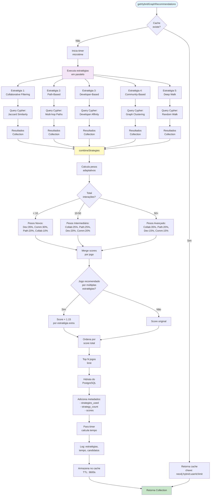
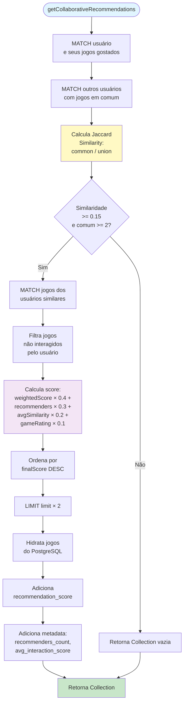
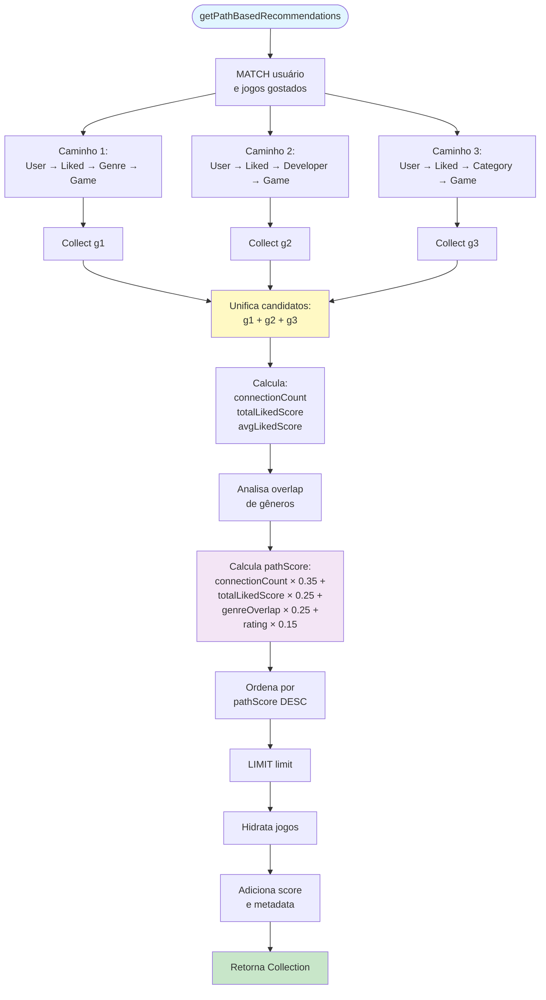
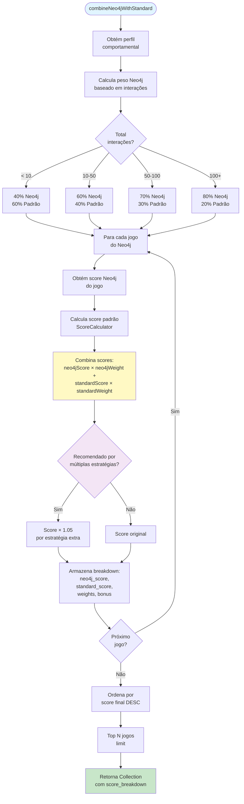
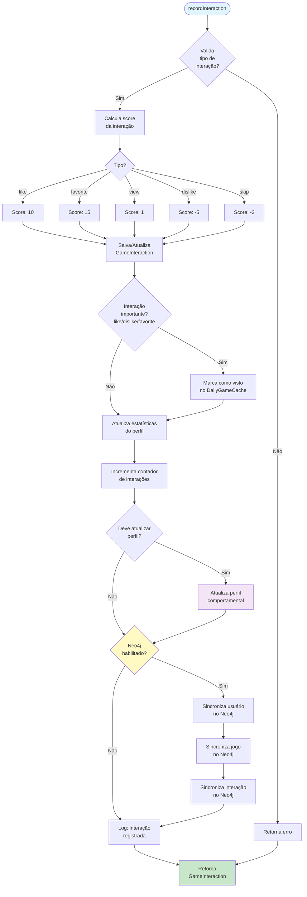
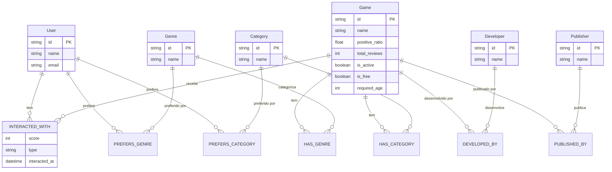
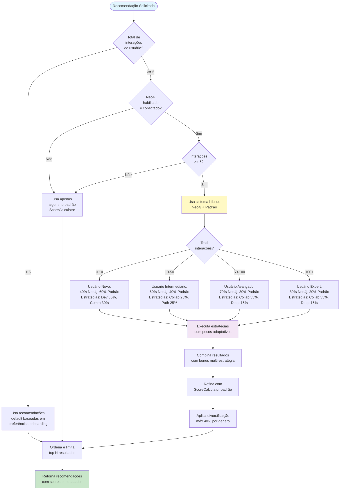
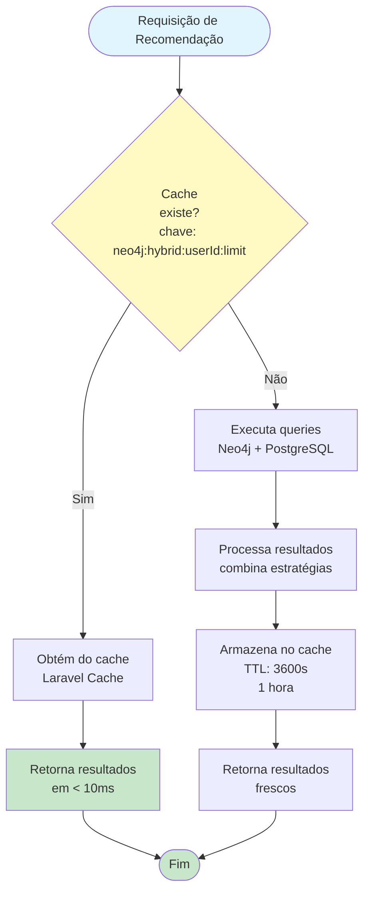
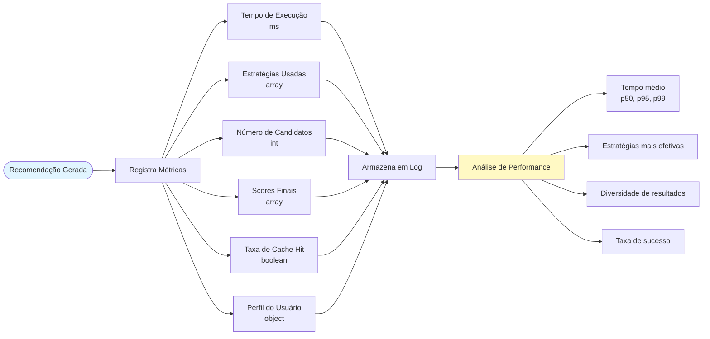

# Fluxograma da API de Recomendações

> **📌 Fluxograma Principal**: O fluxograma principal completo e didático está disponível em [FLOWCHART_PRINCIPAL.md](./FLOWCHART_PRINCIPAL.md)

Este documento contém os fluxogramas detalhados dos componentes específicos do sistema de recomendações.

## Fluxo Detalhado: Sistema Híbrido Neo4j

## Fluxo Detalhado: Collaborative Filtering

## Fluxo Detalhado: Path-Based Recommendations

## Fluxo Detalhado: Combinação Neo4j + Padrão

## Fluxo: Registro de Interação

## Fluxo: Sincronização Neo4j

```mermaid
flowchart TD
    Start([syncNeo4jGraph]) --> CheckEnabled{Neo4j<br/>habilitado?}
    
    CheckEnabled -->|Não| Return[Retorna sem<br/>sincronizar]
    CheckEnabled -->|Sim| CheckConnected{Neo4j<br/>conectado?}
    
    CheckConnected -->|Não| LogError[Log erro<br/>e retorna]
    CheckConnected -->|Sim| CheckOptions{Opções<br/>especificadas?}
    
    CheckOptions -->|--full| SyncAll[Sincroniza tudo]
    CheckOptions -->|--games| SyncGames[Sincroniza jogos]
    CheckOptions -->|--users| SyncUsers[Sincroniza usuários]
    CheckOptions -->|--interactions| SyncInteractions[Sincroniza interações]
    
    SyncAll --> SyncGames
    SyncAll --> SyncUsers
    SyncAll --> SyncInteractions
    
    SyncGames --> QueryGames[Query PostgreSQL:<br/>Game::where active]
    QueryGames --> LoopGames[Para cada jogo]
    
    LoopGames --> CreateGameNode[CREATE/MERGE<br/>Game node]
    CreateGameNode --> CreateGenres[CREATE/MERGE<br/>Genre nodes<br/>e HAS_GENRE]
    CreateGenres --> CreateCategories[CREATE/MERGE<br/>Category nodes<br/>e HAS_CATEGORY]
    CreateCategories --> CreateDevs[CREATE/MERGE<br/>Developer nodes<br/>e DEVELOPED_BY]
    CreateDevs --> CreatePubs[CREATE/MERGE<br/>Publisher nodes<br/>e PUBLISHED_BY]
    
    CreatePubs --> NextGame{Próximo<br/>jogo?}
    
    NextGame -->|Sim| LoopGames
    NextGame -->|Não| SyncUsers
    
    SyncUsers --> QueryUsers[Query PostgreSQL:<br/>User::all]
    QueryUsers --> LoopUsers[Para cada usuário]
    
    LoopUsers --> CreateUserNode[CREATE/MERGE<br/>User node]
    CreateUserNode --> SyncPreferences[Sincroniza preferências:<br/>PREFERS_GENRE,<br/>PREFERS_CATEGORY]
    
    SyncPreferences --> NextUser{Próximo<br/>usuário?}
    
    NextUser -->|Sim| LoopUsers
    NextUser -->|Não| SyncInteractions
    
    SyncInteractions --> QueryInteractions[Query PostgreSQL:<br/>GameInteraction::all]
    QueryInteractions --> LoopInteractions[Para cada interação]
    
    LoopInteractions --> CreateInteractionRel[CREATE/MERGE<br/>INTERACTED_WITH<br/>relationship]
    CreateInteractionRel --> SetProps[Define propriedades:<br/>score, type,<br/>interacted_at]
    
    SetProps --> NextInteraction{Próxima<br/>interação?}
    
    NextInteraction -->|Sim| LoopInteractions
    NextInteraction -->|Não| LogSuccess[Log: sincronização<br/>concluída]
    
    LogSuccess --> Return
    
    LogError --> Return
    
    style Start fill:#e1f5ff
    style Return fill:#c8e6c9
    style SyncNeo4j fill:#fff9c4
    style CreateGameNode fill:#f3e5f5
```

## Estrutura de Dados no Grafo Neo4j

## Decisões do Algoritmo

## Cache Strategy

## Performance Metrics

---

## Legenda

- 🔵 **Azul claro**: Início/Fim de processos
- 🟢 **Verde**: Retorno de resultados bem-sucedidos
- 🟡 **Amarelo**: Processos críticos/importantes
- 🟣 **Roxo**: Processos auxiliares
- 🔴 **Vermelho**: Erros/Falhas

## Notas Importantes

1. **Cache**: Todas as recomendações são cacheadas por 1 hora (3600s)
2. **Fallback**: Se Neo4j falhar, o sistema usa automaticamente o algoritmo padrão
3. **Pesos Adaptativos**: Ajustados automaticamente baseado no número de interações
4. **Diversificação**: Máximo de 40% dos resultados podem ser do mesmo gênero
5. **Sincronização**: Interações são sincronizadas automaticamente para o Neo4j
6. **Logs**: Todas as operações geram logs detalhados para monitoramento

