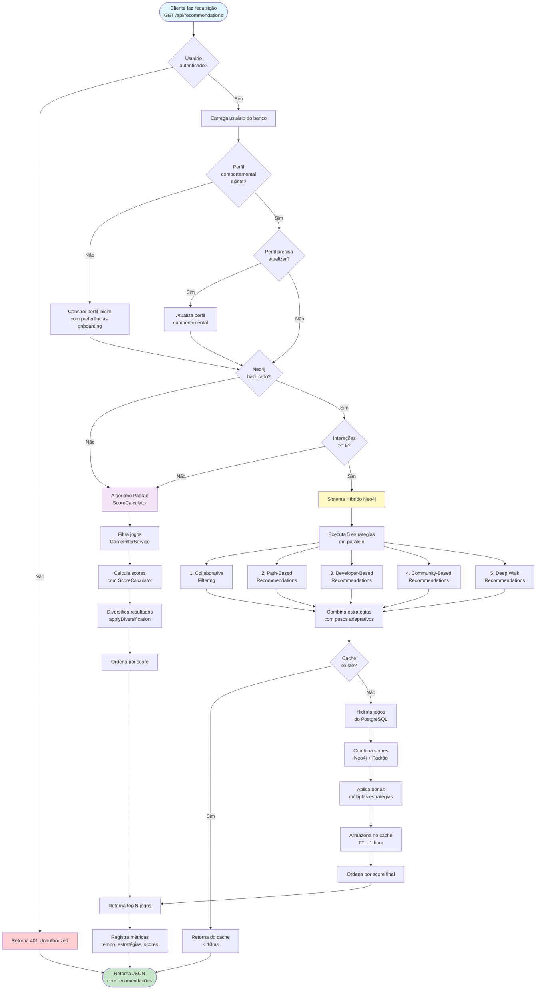

# Fluxograma Principal - Sistema de Recomendações

## Visão Geral

Este documento apresenta o fluxograma principal do sistema de recomendações de jogos, demonstrando como o sistema processa uma requisição de recomendação desde a autenticação do usuário até o retorno dos jogos recomendados.

O sistema utiliza uma arquitetura híbrida que combina:
- **Algoritmo Padrão**: Baseado em filtros e scores calculados a partir do perfil comportamental do usuário
- **Sistema Neo4j**: Utiliza grafos para recomendações baseadas em relacionamentos complexos entre usuários, jogos, gêneros e desenvolvedores

## Fluxograma Principal

## Explicação Detalhada das Etapas

### 1. Autenticação e Validação (Início do Fluxo)

**Etapa**: Cliente faz requisição → Verificação de autenticação

- **Entrada**: Requisição HTTP GET para `/api/recommendations`
- **Validação**: Verifica se o usuário está autenticado através do token de acesso
- **Saída Negativa**: Se não autenticado, retorna erro 401 (Unauthorized)
- **Saída Positiva**: Se autenticado, carrega os dados do usuário do banco de dados

### 2. Gerenciamento de Perfil Comportamental

**Etapa**: Carregamento do usuário → Verificação/Construção do perfil

O sistema mantém um **perfil comportamental** que armazena as preferências do usuário baseadas em suas interações anteriores (likes, favoritos, visualizações, etc.).

- **Perfil não existe**: Constrói um perfil inicial usando as preferências coletadas durante o onboarding do usuário
- **Perfil existe**: Verifica se precisa ser atualizado (ex: novas interações desde a última atualização)
- **Atualização necessária**: Recalcula o perfil comportamental com base nas interações mais recentes

### 3. Decisão do Algoritmo de Recomendação

**Etapa**: Verificação do Neo4j → Escolha do algoritmo

O sistema decide qual algoritmo utilizar baseado em dois critérios:

#### 3.1. Verificação do Neo4j
- **Neo4j não habilitado**: Usa apenas o algoritmo padrão
- **Neo4j habilitado**: Prossegue para verificação de interações

#### 3.2. Verificação de Interações
- **Menos de 5 interações**: Usuário ainda não tem histórico suficiente, usa algoritmo padrão
- **5 ou mais interações**: Usuário tem histórico suficiente, pode usar o sistema híbrido Neo4j

### 4. Algoritmo Padrão (ScoreCalculator)

**Quando usado**: 
- Neo4j não está habilitado, OU
- Usuário tem menos de 5 interações registradas

**Processo**:
1. **Filtragem**: Filtra jogos disponíveis usando `GameFilterService` (remove jogos inativos, aplica filtros de idade, etc.)
2. **Cálculo de Scores**: Calcula scores para cada jogo usando o `ScoreCalculator`, que considera:
   - Preferências do perfil comportamental
   - Avaliações dos jogos
   - Popularidade
   - Compatibilidade com preferências do usuário
3. **Diversificação**: Aplica algoritmo de diversificação para garantir variedade (máximo 40% dos resultados do mesmo gênero)
4. **Ordenação**: Ordena jogos por score decrescente
5. **Retorno**: Retorna os top N jogos recomendados

### 5. Sistema Híbrido Neo4j

**Quando usado**: 
- Neo4j está habilitado E conectado, E
- Usuário tem 5 ou mais interações registradas

**Processo**:

#### 5.1. Execução de Estratégias em Paralelo
O sistema executa **5 estratégias diferentes simultaneamente** para encontrar jogos candidatos:

1. **Collaborative Filtering**: Encontra usuários similares e recomenda jogos que eles gostaram
2. **Path-Based Recommendations**: Analisa caminhos no grafo (ex: usuário → gênero → jogo)
3. **Developer-Based Recommendations**: Recomenda jogos de desenvolvedores que o usuário já gostou
4. **Community-Based Recommendations**: Usa clustering de comunidades no grafo para encontrar jogos populares em grupos similares
5. **Deep Walk Recommendations**: Utiliza algoritmos de caminhada aleatória no grafo para descobrir relacionamentos ocultos

#### 5.2. Combinação de Estratégias
- **Pesos Adaptativos**: Cada estratégia recebe um peso baseado no histórico do usuário:
  - **Usuário novo (< 10 interações)**: Foco em Developer (35%) e Community (30%)
  - **Usuário intermediário (10-50 interações)**: Balanceamento entre Collaborative (25%) e Path-Based (25%)
  - **Usuário avançado (50+ interações)**: Foco em Collaborative (35%) e Deep Walk (15%)
- **Merge de Scores**: Combina os scores de todas as estratégias usando os pesos calculados

#### 5.3. Sistema de Cache
- **Cache Hit**: Se os resultados já estão em cache (chave: `neo4j:hybrid:userId:limit`), retorna imediatamente (< 10ms)
- **Cache Miss**: Se não está em cache, prossegue com o processamento completo

#### 5.4. Hidratação e Combinação Híbrida
- **Hidratação**: Busca dados completos dos jogos do PostgreSQL (nome, descrição, imagens, etc.)
- **Combinação Híbrida**: Combina scores do Neo4j com scores do algoritmo padrão:
  - **Usuário novo**: 40% Neo4j + 60% Padrão
  - **Usuário intermediário**: 60% Neo4j + 40% Padrão
  - **Usuário avançado**: 70% Neo4j + 30% Padrão
  - **Usuário expert**: 80% Neo4j + 20% Padrão
- **Bonus Multi-Estratégia**: Jogos recomendados por múltiplas estratégias recebem um bônus de 5-15% no score final
- **Armazenamento em Cache**: Armazena resultados no cache com TTL de 1 hora (3600 segundos)

### 6. Finalização e Retorno

**Etapa**: Ordenação → Logging → Retorno

1. **Ordenação Final**: Ordena todos os jogos por score final (decrescente)
2. **Registro de Métricas**: Registra métricas importantes para análise:
   - Tempo de execução
   - Estratégias utilizadas
   - Scores calculados
   - Número de candidatos encontrados
3. **Retorno**: Retorna JSON com a lista de jogos recomendados, incluindo:
   - Dados completos dos jogos
   - Scores de recomendação
   - Metadados sobre as estratégias utilizadas
   - Breakdown dos scores (quando aplicável)

## Legenda de Cores

- 🔵 **Azul claro** (`#e1f5ff`): Início e fim de processos
- 🟢 **Verde** (`#c8e6c9`): Retorno de resultados bem-sucedidos
- 🟡 **Amarelo** (`#fff9c4`): Processos críticos/importantes (Sistema Híbrido Neo4j)
- 🟣 **Roxo** (`#f3e5f5`): Processos auxiliares (Algoritmo Padrão)
- 🔴 **Vermelho** (`#ffcdd2`): Erros/Falhas (401 Unauthorized)

## Características Importantes do Sistema

### 1. Adaptabilidade
O sistema se adapta automaticamente ao histórico do usuário:
- Usuários novos recebem recomendações mais genéricas baseadas em preferências de onboarding
- Usuários com histórico recebem recomendações cada vez mais personalizadas

### 2. Performance
- **Cache inteligente**: Resultados são cacheados por 1 hora, reduzindo tempo de resposta de ~500ms para < 10ms em requisições subsequentes
- **Processamento paralelo**: As 5 estratégias Neo4j são executadas simultaneamente, otimizando tempo de resposta

### 3. Robustez
- **Fallback automático**: Se o Neo4j falhar ou não estiver disponível, o sistema usa automaticamente o algoritmo padrão
- **Validações**: Múltiplas validações garantem que apenas dados válidos sejam processados

### 4. Diversidade
- **Diversificação**: Garante que não mais de 40% dos resultados sejam do mesmo gênero
- **Múltiplas estratégias**: 5 estratégias diferentes garantem variedade nas recomendações

### 5. Rastreabilidade
- **Logs detalhados**: Todas as operações geram logs com métricas para análise posterior
- **Metadados**: Cada recomendação inclui informações sobre como foi gerada

## Fluxos Alternativos

### Fluxo de Erro (401 Unauthorized)
Se o usuário não estiver autenticado, o sistema retorna imediatamente um erro 401 sem processar nenhuma recomendação.

### Fluxo de Cache Hit
Se os resultados já estão em cache, o sistema retorna imediatamente sem executar nenhuma query ou processamento adicional, garantindo resposta em menos de 10ms.

## Conclusão

Este fluxograma demonstra um sistema de recomendações robusto e adaptativo que:
- Se ajusta automaticamente ao perfil do usuário
- Utiliza múltiplas estratégias para garantir qualidade e diversidade
- Otimiza performance através de cache inteligente
- Mantém robustez através de fallbacks automáticos
- Fornece rastreabilidade completa através de logs e metadados

